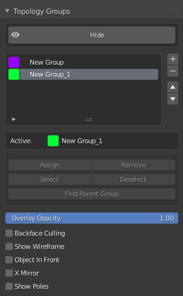

# RetopoView

This small addon adds support for drawing colourful overlays over a mesh based on user-defined face groups. Overlays are drawn on top of the mesh and are based on a custom data layer - this makes it independent of viewport shading modes, materials, vertex colours, or any other data.

The addon can be found under `Properties > Object Data Properties > Topology Groups` or using `Shift + F` to call a pie menu - it is primarily built for quick use when working in Edit Mode and doing retopology to mark topology flow or key loops.

|Viewport|UI|
|:---|:---|
|||